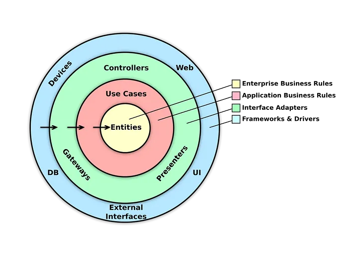
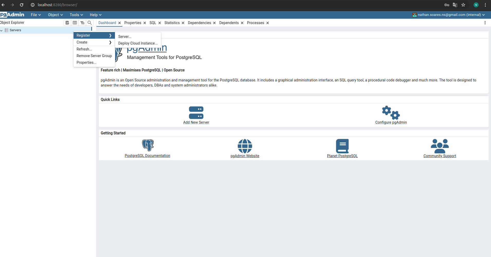
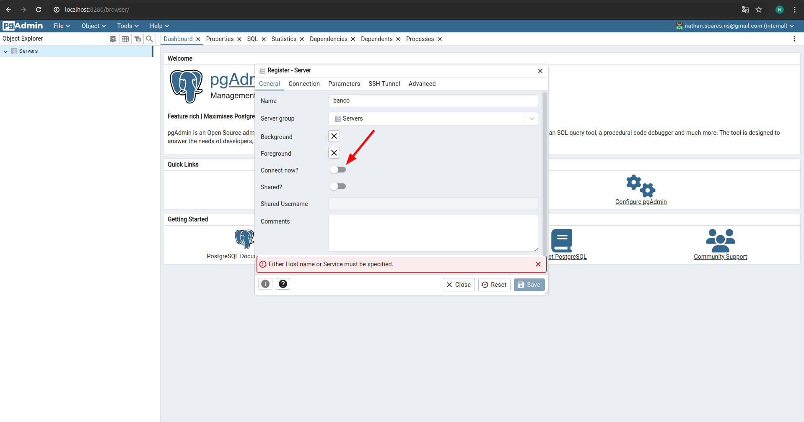
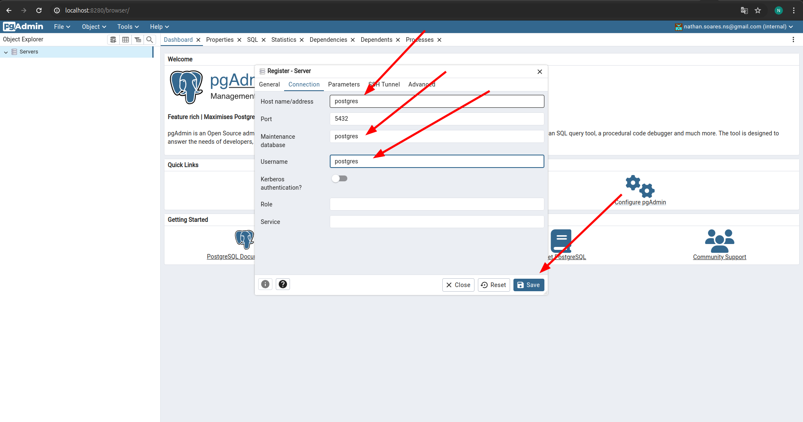
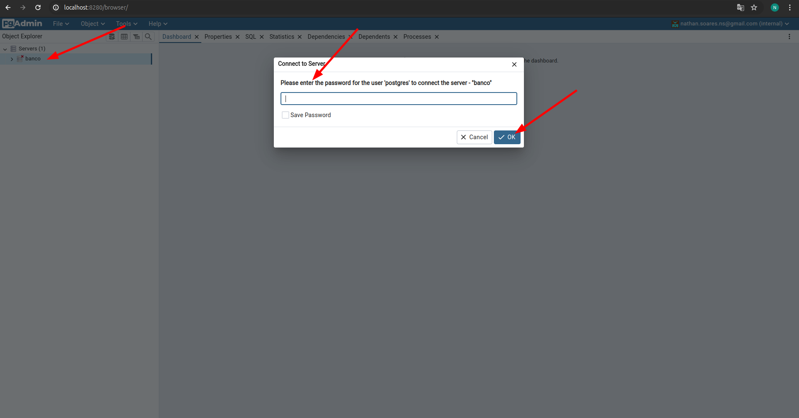
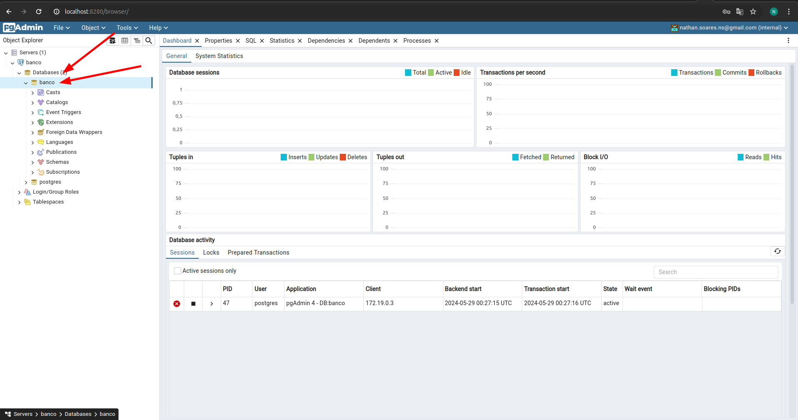

# Projeto Hotel

Este projeto vem a calcular a estadia do usuario
fazer checkin, checkout e incluir hóspedes. 

Este projeto buscou utilizar clean architecture



# Configurações para iniciar o projeto

Primeiramente dentro da pasta docker-compose há um arquivo
iniciar as dependencias do projeto (PostgreSQL) e o pgAdmin 
para acessar dados caso assim desejar.

Abra o terminar na raiz do projeto e rode este comando.

```docker compose -f docker-compose/postgresql.yaml up -d```

Caso não tenha docker instalado na máquina, clique [aqui](https://docs.docker.com/engine/install/) 

Para derrubar todos containers da máquina, você pode usar o comando abaixo.

Cuidado! Esse comando derrubará todos os containers da sua máquina.

```docker compose -f docker-compose/postgresql.yaml down --remove-orphans```

# Utilizar o pgAdmin

Siga as imagens abaixo.

Acesse o link http://localhost:8280/ e realize o login

O login e senha são nathan.soares.ns@gmail.com / nathan_teste_hotel







### Aqui você coloca a senha "postgres" e pressiona ok



